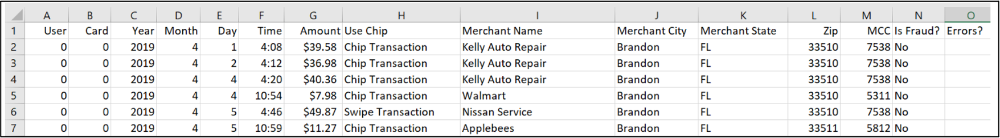

# Tabular Transformers for Modeling Multivariate Time Series

This repository provides the pytorch source code, and data for tabular transformers (TabFormer). Details are described in the paper [Tabular Transformers for Modeling Multivariate Time Series](http://arxiv.org/abs/2011.01843 ), submitted to ICASSP 2021.

#### Summary
* Modules for hierarchical transformers for tabular data
* A synthetic credit card transaction dataset
* Modified Adaptive Softmax for handling masking
* Modified _DataCollatorForLanguageModeling_ for tabular data
* The modules are built within transformers from HuggingFace 🤗. (HuggingFace is ❤️)
---
### Requirements
* Python (3.7)
* Pytorch (1.6.0)
* HuggingFace / Transformer (3.2.0)
* scikit-learn (0.23.2)
* Pandas (1.1.2)

(X) represents the versions which code is tested on.

These can be installed using pip by running : 
```
pip install -r requirements.txt
```
---

### Credit Card Transaction Dataset

The synthetic credit card transaction dataset is provided in [./data/credit_card](/data/credit_card/). There are 24M records with 12 fields.
You would need git-lfs to access the data.



---

### Tabular BERT
To train a tabular BERT model on credit card transaction or PRSA dataset run :
```
$ python main.py --do_train --mlm --field_ce --lm_type bert \
                 --field_hs 64 --data_type [prsa/card] \
                 --output_dir [output_dir]
```


### Tabular GPT2
To train a tabular GPT2 model on credit card transactions for a particular _user-id_ :
```

$ python main.py --do_train --lm_type gpt2 --field_ce --flatten --data_type card \
                 --data_root [path_to_data] --user_ids [user-id] \
                 --output_dir [output_dir]
    
```

Description of some options (more can be found in _`args.py`_):
* `--data_type` choices are `prsa` and `card` for Beijing PM2.5 dataset and credit-card transaction dataset respecitively. 
* `--mlm` for masked language model; option for transformer trainer for BERT
* `--field_hs` hidden size for field level transformer
* `--lm_type` choices from `bert` and `gpt2`
* `--user_ids` option to pick only transacations from particular user ids.
---

### Citation

```
@misc{padhi2020tabular,
      title={Tabular Transformers for Modeling Multivariate Time Series}, 
      author={Inkit Padhi and Yair Schiff and Igor Melnyk and Mattia Rigotti and Youssef Mroueh and Pierre Dognin and Jerret Ross and Ravi Nair and Erik Altman},
      year={2020},
      eprint={2011.01843},
      archivePrefix={arXiv},
      primaryClass={cs.LG}
}
```
